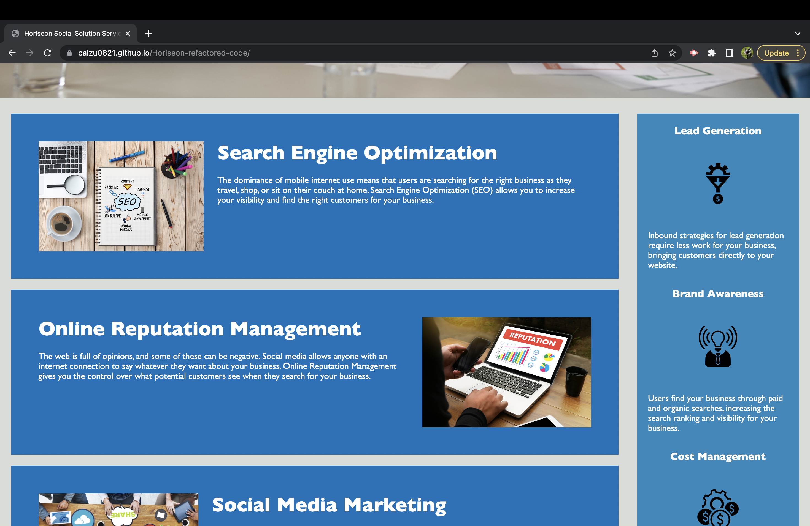
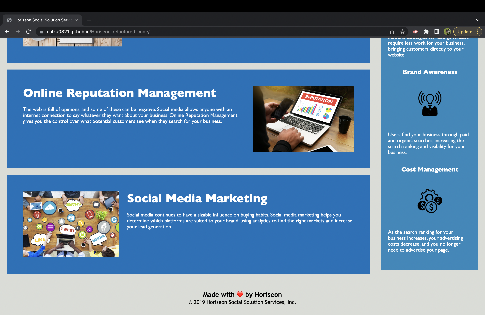

# Horiseon-refactored-code

## Description

For this particular challenge, a marketing agency has hired me to refactor an existing site's code and make it more accessible. This code was improved without changing what it does so that it meets a cetain set of standards or to implement new technology for users.

My motivation was to make this code accessible to ensure that the webpage can be used by the widest possible audiance including people with disabilites or those using assistative technologies (i.e. screen readers).

While refactoring this code by making it semantic and accessible, I learned best practices for web development and improved my skills in creating products that are more inclusive and user-friendly.

## Installation

Follow these steps to install this project:

1. Clone the repository on your local machine using the following command:

git clone https://github.com/calzu0821/Horiseon-refactored-code.git

2. Open the index.html file in your web browser to view the webpage.

## Usage

To use this project, open the index.html file in your web browser. The webpage will display the refactored code , which is more accessible and SEO compatible.

Deployed website:

 https://calzu0821.github.io/Horiseon-refactored-code/

Screenshot of refactored code:

  

## Credits

I used the following third-party assets in this project:

- https://www.whoisaccessible.com/guidelines/how-to-use-the-chrome-lighthouse-for-accessibility-audits/
- https://meiert.com/en/blog/dry-css/
- https://www.semrush.com/blog/semantic-html5-guide/
- https://community.codenewbie.org/kwing25/how-to-write-a-good-readme-for-your-project-16ej
- https://developer.mozilla.org/en-US/docs/Web/HTML/Element#main_root
- https://www.markdownguide.org/basic-syntax/
- https://www.w3schools.com/html/html5_semantic_elements.asp
- https://www.w3schools.com/html/html_accessibility.asp

## License

N/A
